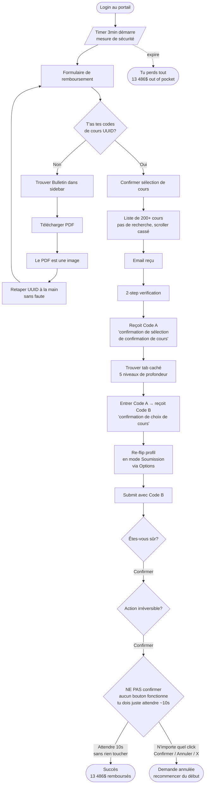

# Flow principal : demande de remboursement de bourse

Le parcours central du jeu. C'est l'expérience qu'on veut que les utilisateurs vivent, donc il faut que chaque étape soit pire que la précédente. Le but global : juste essayer de récupérer ses 13 486 $ pour pas avoir à payer sa session de poche.

## Le vibe visuel

Référence directe : ColNet (le portail du Collège Lionel-Groulx). Genre vraiment, on le copie. C'est l'archétype du portail étudiant institutionnel pas d'amour.

Caractéristiques à reproduire :
- En-tête rouge solide, avec logo à gauche pis nom de l'utilisateur + date + bouton DÉCONNECTER à droite
- Sidebar à gauche, fond blanc, avec des sections rouges en majuscules (MON DOSSIER, MON COLLÈGE)
- Une trentaine d'items dans la sidebar, presque tous mal classés, certains qui ont rien à voir avec rien
- Zone principale avec une barre de titre grise/bleue ("ACCUEIL - ColNet Enseignement régulier")
- Boîtes avec bordures fines, fonds beige/gris pâle
- Tableaux denses, texte minuscule, liens soulignés bleus
- Genre Times/Arial 11px partout
- Aucune respiration, aucun whitespace, tout collé

Ça doit avoir l'air d'un site fait en 2003 pis jamais retouché depuis. Si quelqu'un regarde l'app pis pense "wow ça a l'air vieux", on a réussi.

## Le scénario

Tu te connectes, tu vois ton solde : **13 486 $**. Quelque part dans la sidebar (sous un nom obscur genre "État de compte" ou "Documents") il y a une option pour demander un remboursement / aide financière / appliquer pour la bourse. Tu cliques. Là le party commence.

## Le parcours, étape par étape

### Étape 1 — Le countdown commence (mais tu le vois pas)

Au moment ou tu cliques pour démarrer le processus, un timer commence à rouler en arrière-plan. Genre 3 minutes, ou peut-être moins. C'est présenté comme une **mesure de sécurité** ("Pour votre protection, cette session expirera dans..."), comme si c'était normal.

**Sauf que le timer est invisible par défaut.** Pour savoir combien de temps il te reste, faut entrer un **code à 6 chiffres** dans une dialog spéciale.

Le premier code, **on te le donne** quand tu commences le formulaire. Joli geste. Tu l'utilises une fois pour voir ton timer pendant 10 secondes, après quoi la fenêtre se referme toute seule pis le timer redevient invisible. Le code est maintenant **brûlé**. One-time use.

Tu veux re-checker ? Faut **régénérer un nouveau code** dans un autre tab (probablement quelque part style "Sécurité > Codes de vérification de session", caché dans la sidebar). Tu navigues là, tu génères un nouveau code, tu reviens à la fenêtre, tu rentres le code, tu vois le timer 10 secondes, le code est brûlé. Re-fait le tout pour la prochaine vérification.

Donc :
- 1ʳᵉ vérification : "gratuite" (le code t'est donné en commençant)
- Toutes les autres : navigation aller-retour pour générer un nouveau code à chaque fois

Pendant TOUTE cette danse-là, **le timer principal continue de descendre**. Vérifier combien de temps il reste te coûte du temps. Plus tu vérifies, plus tu gaspilles. C'est exactement le but.

#### Les notifs aux jalons (fausse miséricorde)

Le timer t'envoie quand même des notifs non-sollicitées à certains jalons importants :

- À **1 minute restante** : "Il vous reste 1 minute."
- À **30 secondes** : "Il vous reste 30 secondes."
- À **10 secondes** : "Il vous reste 10 secondes."

À première vue ça a l'air d'une faveur — au moins t'es averti aux moments critiques sans avoir à faire la danse de vérification. Sauf que ces notifs-là sont **un modal massif qui prend 80% de la page** pis qui **bloque toutes les interactions** pendant qu'il est là. Pas de bouton X, pas de "OK", pas de moyen de le fermer. Tu attends. Genre 3 secondes.

Donc :
- À 1 min restante : tu perds 3 secondes des 60 qui restent
- À 30 secondes : tu perds 3 des 30 qui restent (10% du temps restant !)
- À 10 secondes : tu perds 3 des 10 qui restent. C'est presque le tier de ton temps.

Le modal peut afficher quelque chose de gentil genre "Pour vous aider à gérer votre temps, voici un rappel" pour que ça ait l'air d'une fonctionnalité utile, alors que c'est en fait une attaque déguisée.

Si le timer expire, t'es out, tu perds la demande, pis le solde reste à 13 486 $. Faut recommencer.

Le timer **continue de rouler** quand des modals ouvrent. Le timer **continue** quand t'es dans un PDF. Le timer **continue** quand tu fais la danse pour le voir.

### Étape 2 — Le formulaire de demande

Le formulaire te demande :
- Ton **numéro étudiant** (que tu sais probablement pas par cœur — pis bonne chance pour le trouver, voir plus bas)
- Les **codes de 3 cours** que t'as faits, format UUID genre `420KBKLG-000002` (tirés de ton bulletin)

Évidemment, le formulaire te dit pas ou aller chercher ces infos-là. Faut deviner.

#### Le numéro étudiant — le piège du mode profil

Ton numéro étudiant est dans tes settings de profil. Mais par défaut, il est **caché**. Pour le voir, faut que tu mettes ton profil en **mode "Observation"** (un toggle quelque part dans les Options du profil).

Une fois en mode Observation : tu peux voir ton numéro, le copier, le sortir de là.

**Le piège :** en mode Observation, tu peux **rien soumettre**. Aucun formulaire. Tous les boutons Submit du portail deviennent désactivés (sans message d'erreur clair, juste grisés). Pour pouvoir re-soumettre, faut basculer le profil en **mode "Soumission"** (l'inverse). Mais en mode Soumission, tu peux **plus rien consulter** — y compris ton numéro étudiant. Pis y compris ton bulletin pour aller chercher les codes de cours, hint hint.

Donc l'ordre des opérations c'est :
1. Profil en mode Observation
2. Aller chercher tes infos (no étudiant + codes de cours du bulletin)
3. Tout noter quelque part en dehors du portail (parceque sinon tu vas devoir re-flip une autre fois)
4. Profil en mode Soumission
5. Retourner au formulaire, tout entrer, soumettre

Si tu te trompes d'ordre tu fais des allers-retours pour rien, pis le timer roule pendant ce temps-là. Le portail nulle part te dit que ces deux modes existent ou comment les flipper. Tu l'apprends à la dure.

### Étape 3 — La chasse au bulletin

Tu cherches dans la sidebar. "Bulletin" est là quelque part, mais entre "Bibliothèque Koha" pis "Casier". Tu cliques.

Tu tombes sur une page qui te demande de **télécharger un PDF** pour avoir ton bulletin. Le PDF s'ouvre.

Tu essayes de copier le code du cours.

**C'est une image.** Le PDF est juste une grosse image scannée. Tu peux rien copier.

Donc tu retapes les UUIDs à la main. Sans faute. Le formulaire valide en strict, fait que si tu mets un `0` à place d'un `O` ou vice-versa, c'est rejeté pis tu recommences le champ.

### Étape 4 — Confirmer la sélection de cours

Une fois les codes entrés, le formulaire te dit "Veuillez confirmer votre sélection de cours". Tu pèses Suivant.

Tu tombes sur une **liste de tous les cours offerts par le collège**. Pas juste les tiens — tous. Y en a 200+. Certains ont pas été donnés depuis les années 90 mais sont encore là parceque "personne a fait le ménage".

- **Pas de barre de recherche.** Évidemment.
- **Texte minuscule.** Comme 10px.
- **Mauvais scroller.** Custom scroll qui bug, qui scrolle pas vite quand tu veux, pis qui scrolle tellement vite que tu sautes 50 cours quand tu pousses un peu plus.
- **Pas de tri.** Liste dans un ordre apparemment aléatoire.

Faut que tu cliques les 3 cours que t'as déjà entrés. Pour les retrouver. Dans la liste de 200+. Avec le timer qui roule.

### Étape 5 — La cascade d'emails

Tu confirmes. Bravo. Un message apparaît : "Un courriel vous a été envoyé."

Tu vas dans ton inbox (faut sortir de l'app, ce qui interrompt rien parceque le timer continue dehors aussi).

Le courriel contient un **2-step verification**. Tu cliques le lien, ça ouvre une page qui te demande un code envoyé par texto. Tu entres le code.

La page te donne maintenant un **code de confirmation de sélection de confirmation de cours**. Oui. Lis-le 2 fois. C'est le code A.

Mais le code A sert pas à submit. Le code A sert à **récupérer un autre code**. Le **code de confirmation de choix de cours** (code B). Le code B, lui, sert à submit.

### Étape 6 — Le tab caché

Pour utiliser le code A et obtenir le code B, faut aller dans un écran spécifique qui est caché dans des nested tabs. Genre :

`Mon dossier > Documents > Confirmations > Codes > Validation > Sélection`

(et chaque niveau est un onglet horizontal différent qui ressemble à rien). Aucune indication que c'est là qu'il faut aller. Le seul indice c'est une mention de "Validation des sélections" dans un footer en gris pâle quelque part.

Tu trouves l'écran, tu entres le code A, ça te crache le code B.

### Étape 7 — Re-flip le profil en mode Soumission

Tu te souviens du toggle de profil de l'Étape 2 ? Surprise, il fait son grand retour.

Pour aller chercher le code A pis le code B aux étapes 5 et 6, t'as probablement re-besoin du mode **Observation** (parceque consulter des emails / des codes ça compte comme de la consultation, pis le portail est cohérent dans son incohérence). Donc à ce stade ton profil est probablement en mode Observation.

Sauf que pour soumettre le formulaire, faut être en mode **Soumission**. Pis le formulaire te dit **pas** que c'est ça le problème — il dit juste "Action impossible" ou "Vos paramètres ne permettent pas cette opération", quelque chose de cryptique. À toi de comprendre que c'est le mode profil qui bloque.

Tu retournes dans Options, tu re-flippes en mode Soumission, tu reviens au formulaire. Bien sûr en flippant tu perds l'accès en lecture, donc si t'avais pas tout noté/copié pour avoir les codes A et B sous la main avant de flipper... ben faut re-faire des étapes. Le timer roule toujours.

Note : c'est volontairement le **dernier** vrai obstacle avant le submit. Le tout est conçu pour que tu fasses ton setup, que t'oublies que t'es en mode Observation, pis que tu te frappes contre le mur juste là, à 30 secondes restantes.

### Étape 8 — Submit

Tu rentres le code B dans le formulaire. Tu pèses Soumettre.

**Pop-up : "Êtes-vous sûr ?"**

Tu cliques Oui.

**Deuxième pop-up : "Cette action est irréversible. Confirmer ?"**

Tu cliques Confirmer.

**Troisième pop-up : "Veuillez NE PAS confirmer une troisième fois. Confirmer annulera toute la demande."**

C'est le piège. Après avoir cliqué Confirmer 2 fois d'affilée, ton cerveau est en autopilot, pis ton doigt va naturellement cliquer Confirmer une 3e fois. Si tu le fais : tout est annulé, t'as perdu ton temps, le solde reste à 13 486 $, faut recommencer du début (avec un nouveau timer).

La bonne action c'est de **rien faire**. Tu attends ~10 secondes sans toucher à rien. Le popup va se fermer tout seul pis la requête va partir, succès. Mais évidemment, le timer principal **continue de rouler** pendant ces 10 secondes-là, donc tu regardes ton compte à rebours descendre en espérant que t'as bien compris l'instruction pis que t'as pas faite une grosse erreur. C'est cruel pis c'est exactement le but.

Détails à respecter :
- Aucun bouton dans le popup ne fait l'action voulue. Cliquer Confirmer = annuler tout. Cliquer Annuler/Fermer/X = aussi annuler tout (parceque "vous avez interrompu le processus de confirmation").
- La seule façon c'est l'inaction.
- Aucun indicateur visuel de combien de secondes il reste à attendre. Tu devines.

Si tu réussis à attendre : la requête part, une notif verte s'affiche pendant 0.5 seconde pis disparaît avant que tu puisses la lire.

## Diagramme du parcours

## Ce qu'on construit dans l'app

Pour faire marcher ce flow, faut au minimum :

- **La page d'accueil** (le ColNet-like avec sidebar de 30+ items)
- **Le système de timer global** (commence au click sur "demande", continue partout, expire sans avertissement)
- **Le formulaire de demande de bourse** (avec validation stricte, messages d'erreur cryptiques)
- **La page Bulletin** (qui sert juste un PDF qui est une image)
- **La liste de tous les cours** (le composant scroller cassé, ~200 entrées hardcodées)
- **Le système d'email mock** (probablement un panneau "Boîte courriel" interne avec des messages fakes)
- **L'écran de validation 2FA**
- **L'écran caché de génération de code** (dans nested tabs)
- **La page Options** avec le setting random à régler
- **Tous les modals de confirmation en cascade** sur le submit

Le backend Fastify gère :
- Auth (faux login, peu importe)
- État de la session (timer côté serveur pour pas qu'on triche en pausant le tab)
- Génération des codes (Code A, Code B) avec un délai artificiel
- "Envoi" d'email (dans le mock inbox)
- Validation finale du submit

## États de fin

- **Succès** : tu finis dans le temps, écran de succès qui s'affiche genre 0.5s pis disparaît, le solde devient 0$. Aucune célébration. Aucun feedback satisfaisant.
- **Échec (timeout)** : écran rouge, "Votre session a expiré pour des raisons de sécurité. Veuillez recommencer.", le solde reste 13 486$, pis tu peux recommencer (avec un nouveau timer).

L'idée c'est que même la victoire devrait pas être satisfaisante. C'est ça la cerise sur le sundae.

## Propositions en attente

- **[Vérification biométrique avec ML + caméra](./proposition_biometrique.md)** — étape optionnelle entre Étape 4 et 5 ou l'utilisateur doit faire des grimaces / gestes devant sa webcam. À discuter avec le partenaire avant de commencer à implémenter.
