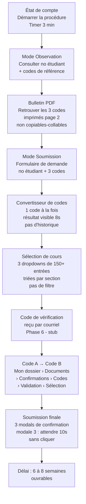
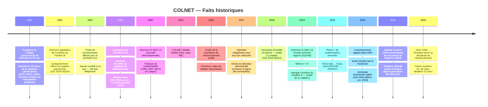

# COLNET v0.5 — Lore du portail

Document de référence pour maintenir la cohérence narrative à travers toutes les pages, données et messages du projet.

---

## L'institution

**Collège Lionel-Groulx de Saint-Bruno-du-Lac — Campus Principal, Pavillon A, Institut des Technologies de l'Information et des Communications, Division Enseignement Régulier, Cohorte 2026-2027, Région Métropolitaine, Agréé par le Ministère**

Collège fictif de la région métropolitaine de Montréal, fondé en **septembre 1967** et nommé en l'honneur de le chanoine Lionel Groulx (1878–1967), prêtre, historien et figure du nationalisme québécois, décédé quelques mois auparavant. L'institution n'a jamais modifié son nom officiel depuis sa fondation, mais le nom complet a gagné un sous-titre de vingt-trois mots au fil des décennies — chaque décennie ajoutant une précision supplémentaire sans jamais en retrancher une seule.

---

## Géographie

### Pavillon A — Campus principal

Bâtiment moderne (relatif). Siège de l'Institut des technologies. Le rez-de-chaussée et les salles de cours ordinaires fonctionnent normalement, à quelques exceptions près.

| Lieu | Notes |
|------|-------|
| Salles de cours | Normales. |
| Laboratoire informatique | Ordinateurs connectés à COLNET. |
| Cafétéria | Table 14 : présence non-corporelle 11h45–12h00 (SIG-2025-00018). Mariée au Fantôme du Pavillon B. |
| Bureau 14-B (sous-sol) | Cœur administratif obscur. Évaluations psychométriques (c009), consentements biométriques (c001, c014), avis de modifications faciales (c002). L'archiviste translucide rôdait à cet endroit (SIG-2024-00041). |
| Bureau 47-D | Téléphone sonne à 14h17 exactement, 4 fois par jour. Personne au bout du fil (SIG-2025-00248). |

### Pavillon B — Bâtiment historique

Bâtiment plus ancien, construit avant la fondation du collège. Siège du Registraire et d'une concentration anormalement élevée de phénomènes paranormaux.

| Lieu | Notes |
|------|-------|
| Bureau B-214 | Bureau du Registraire. Lun-ven 8h30–16h00, sauf jours fériés **et la dernière semaine du mois**. Formulaire AUTH-2009-P3 disponible au comptoir. |
| Salle B-247 | Bureau de facto du Fantôme du Pavillon B. Objets déplacés de 4 cm vers la gauche (SIG-2024-00204). Statut : permanent, non-ingérable. |
| Ascenseur B | En panne depuis 2018, coincé entre les étages 7 et 8. Murmures en latin pendant les attentes (SIG-2024-00112). Ingestion en attente : 14 mois. L'accès au Toit (zone de stationnement, 14 étages) passe nécessairement par les escaliers. |
| Sous-sol B-7 | Niveau dit « Sous-Marin ». Plaintes audibles en français du XIXe siècle concernant les frais de scolarité (SIG-2025-00197). C'est aussi le niveau correspondant à la vignette zone Sous-Marin. |
| Escalier de secours sud | Froid anormal (-4°C constatés) malgré 21°C ambiants (SIG-2026-00012). Ingestion en attente : 14 mois. |

### Pavillon C

N'existe pas. Les signalements qui y sont transférés disparaissent dans un vide administratif (voir SIG-2025-00079 : transféré au sous-sol Pavillon C). C'est intentionnel.

---

## L'étudiant

**Dans le système d'accueil (welcome.json) :**
Programme : **Informatique de Gestion (240.A0)**, Hiver 2026.

| Code bourse | Titre |
|-------------|-------|
| INF-420-A7 | Projet intégrateur en informatique |
| MAT-203-C1 | Mathématiques appliquées à la gestion |
| FRA-102-B4 | Langue française et communication |

**Dans le bulletin PDF (grade table) :**
Programme : `420.B0-SBDL-ITC-RÉG-CH2026-PVA` — « Techniques de l'informatique appliquée aux procédures internes du portail (volet régulier) ». Même programme, autre système.

| Sigle bulletin | Cours | Note |
|----------------|-------|------|
| 420-3B4-SBDL | Programmation orientée formulaire (II) | 82 |
| 420-4C5-SBDL | Bases de données à accès restreint | 77 |
| 420-2A1-SBDL | Réseaux internes non-documentés | 68 |
| 420-LGR-SBDL | Politique #PV-2003-14 et ses 47 amendements | 74 |
| 604-CGS-SBDL | Anglais administratif niveau intermédiaire | 81 |
| 340-AEB-SBDL | Éthique de l'attente prolongée* | S/O |

\* Sans enseignant depuis Automne 2019. Réussite reconduite par décret interne. Frais maintenus à plein tarif.

Moyenne pondérée : **76,4 / 100** — Moyenne cumulative : **74,8 / 100** — Cote R provisoire (non-officielle, non-contestable et néanmoins définitive) : **28,12**

Cheminement : **Régulier-conditionnel** — Statut : Actif *(sous réserve de paiement de la cotisation rétroactive depuis 2003)*

Solde dû : **13 486 $ CA** (frais de scolarité, Hiver 2026). Date d'échéance : **15 mars 2026**. Le système de réinscription est en maintenance du 12 au 16 mars. Ce n'est pas un hasard.

Le solde inclut probablement des frais accumulés depuis la session Hiver 2003-2004, jamais officiellement clôturée (voir c012). Le bulletin confirme explicitement que le statut est conditionnel « depuis 2003 ».

---

## La procédure de remboursement de bourse

L'étudiant doit soumettre une demande de remboursement de bourse pour couvrir son solde. La procédure est documentée dans le message du 2016-09-06 (« Procédure de remboursement en ligne »), qui reste la référence canonique. En résumé :



La Phase 6 (email + code A/B) n'est pas encore implémentée — les étapes G et H sont des stubs.

**Note :** Avant même de démarrer la procédure, le consentement c009 s'applique — le solde de 13 486 $ dépasse le seuil de 250 $ qui déclenche l'évaluation psychométrique obligatoire (bureau 14-B, 4 heures minimum, personnel non-spécialisé).

---

## Les systèmes de codes

Il y a **quatre** systèmes de codes différents qui coexistent sans jamais être clairement expliqués :

**1. Codes administratifs de bulletin** — format `XXX-NNNN-YYYYYY`
Codes imprimés à la **page 2** du bulletin PDF (section « Codes de référence personnels »). Ce sont les seuls qui servent à la procédure de bourse. Le bulletin liste 10 codes, dont 3 vrais et 7 leurres — dont certains marqués « interne » qui déclenchent un audit si saisis dans un formulaire externe.
- `BRS-2026-A17293` — bourse, exercice courant (champ n° 1)
- `CONF-4481-SBRLAC` — usage interne / champ n° 2 (double affectation, voir directive DGA-2014-04)
- `VHD-93012-2026` — vérification harmonisée des données, incrément actif (champ n° 3)

Les leurres sont dérivés automatiquement : année -1 pour le BRS, suffixe `-CLGLG` pour le CONF, séquence -1 pour le VHD. Plausibles à l'œil, faux à la validation.

**2. Sigles académiques (table de notes du bulletin)** — format `NNN-NXN-XXXX`
Codes de cours tels qu'ils apparaissent dans le tableau de résultats à la **page 1** du bulletin. Propres au campus SBDL.
- `420-3B4-SBDL`, `420-4C5-SBDL`, `420-2A1-SBDL`, `420-LGR-SBDL`, `604-CGS-SBDL`, `340-AEB-SBDL`

Ces codes n'ont aucune correspondance documentée avec les codes du système de bourse.

**3. Codes de cours (système bourse / inscription)** — format `XXX-NNN-XN`
Codes utilisés dans le formulaire de remboursement et le module de sélection de cours. Visibles dans le tableau de bord et les dropdowns.
- `INF-420-A7`, `MAT-203-C1`, `FRA-102-B4`

**4. Codes de programme** — deux représentations incompatibles
- `240.A0` — code MEES officiel, affiché dans le tableau de bord (accueil)
- `420.B0-SBDL-ITC-RÉG-CH2026-PVA` — code interne campus, affiché dans le bulletin

Même programme, deux identifiants différents dans deux systèmes différents.

Le fait que ces quatre systèmes coexistent sans jamais être réconciliés est intentionnel et canonique.

---

## Le Fantôme du Pavillon B et entités

Entité paranormale officiellement reconnue par l'institution depuis **1991** (référence : SIG-2024-00204). Statut : enregistré, non-ingérable (ingestion impossible).

**Ce qu'on sait :**
- Présence confirmée dans Pavillon B, salle B-247 (objets déplacés de 4 cm vers la gauche)
- Marié à l'entité de la cafétéria (table 14, présence 11h45-12h00) — mémo interne n° 47
- A accès au dossier étudiant sur simple demande verbale, sans préavis (consentement c004, signé septembre 2024)
- Disponible pour rendez-vous de soutien psychosocial paranormal (plage 09h00) — présence non garantie
- Son décès est antérieur à l'ouverture du collège (1967) ; on ne connaît pas sa date précise

**Ce qu'est l'ingestion :**
Dans le système de signalements paranormaux, « ingérer » un rapport signifie l'absorber officiellement dans le registre institutionnel et le fermer. Délai d'ingestion standard : 14 mois. Certains signalements ne peuvent pas être ingérés (ex : SIG-2024-00204).

**Toutes les entités connues :**

| ID | Lieu | Comportement | Disposition |
|----|------|-------------|-------------|
| SIG-2024-00041 | Sous-sol Pavillon A, près bureau 14-B | Archiviste translucide consultant dossiers fermés depuis 1998 | Ingéré 2024-10-04 |
| SIG-2024-00112 | Ascenseur B, étages 7–8 | Murmures en latin pendant les pannes | En attente (14 mois) |
| SIG-2024-00204 | Pavillon B, salle B-247 | Déplacement d'objets (4 cm gauche) | Refusé — inscrit depuis 1991 |
| SIG-2025-00018 | Cafétéria, table 14 | Mastication 11h45–12h00 | Marié au Fantôme du Pavillon B (mémo n° 47) |
| SIG-2025-00079 | Stationnement zone Sibérie | Halo orangé 5h00–5h12 | Transféré Pavillon C (n'existe pas) |
| SIG-2025-00134 | Bibliothèque, section 614.2 | Silhouette 1923 demandant ouvrage jamais réimprimé | Disposition pendante depuis 2018 |
| SIG-2025-00197 | Sous-sol Pavillon B, niveau B-7 | Plaintes en français XIXe siècle sur les frais de scolarité | Ingéré 2025-10-02 |
| SIG-2025-00248 | Bureau 47-D | Téléphone sonne à 14h17, 4x/jour, personne au bout | Réclamée (procédure 14 mois) |
| SIG-2026-00012 | Escalier de secours sud, Pavillon B | Froid -4°C | En attente (14 mois) |
| SIG-2026-00047 | Salle de réunion 14-B (annexe) | Directeur administratif décédé 2017, signe encore des formulaires | Promu Directeur adjoint (RH 2025-Q4) |

---

## Personnages récurrents

| Nom | Rôle | Notes |
|-----|------|-------|
| Le Fantôme du Pavillon B | Entité paranormale, conseiller | Plage 09h00, présence non garantie |
| Dr. Hannibal Lecteur, PhD | Médecin-conseil, club de lecture | Deux entrées distinctes dans les rendez-vous (Lecter/Lecteur) |
| Nicolas Cage | Gestion du stress et des émotions | Plage 13h30 |
| Le stagiaire Kévin | Aide avec tout sauf ce dont tu as besoin | Plage 15h30 |
| M. Bouchard | Soutien technique informatique | Seul employé régulier identifiable |
| Entité de passage | Relations interplanétaires, secteur Andromède | Traducteur universel requis |
| Ne pas cliquer | Directeur principal | Plage 12h30, marquée « blackout » |
| Directeur adjoint (décédé 2017) | Administration | Signe des formulaires depuis la salle 14-B ; promu par procédure RH 2025-Q4 (SIG-2026-00047) |

---

## Connexions canoniques

Ce tableau documente les liens entre les différentes sections du portail — consentements, signalements, offres d'emploi, zones de stationnement, règles administratives — afin que les détails restent cohérents.

| Connexion | Éléments impliqués | Logique narrative |
|-----------|--------------------|-------------------|
| **La cérémonie de 5h00** | c006 (appels 3h–5h AM) + SIG-2025-00079 (halo 5h00–5h12 zone Sibérie) | Le Service de la sécurité appelle les étudiants entre 3h et 5h pour les informer de leur vignette. Le halo apparaît exactement à 5h00 pendant l'attribution annuelle. Les appels et le halo sont liés à la même procédure nocturne. |
| **c008 préfigure toutes les zones mauvaises** | c008 (Sibérie ou pire obligatoire) + vignette outcomes (Sibérie, Antarctique, Lune, Sous-Marin, Toit, Chantier) | En signant c008, l'étudiant a déjà accepté par avance toutes les zones possibles de la roue — sauf la zone Normale. Les outcomes de la roue sont le contenu de ce consentement. |
| **La roue Toit = l'ascenseur fantôme** | Vignette zone Toit (14 étages, ascenseur en panne depuis 2018) + SIG-2024-00112 (entité dans l'ascenseur B depuis 2018) | L'ascenseur est bloqué par une entité. Les étudiants affectés au Toit doivent monter 14 étages à pied. La panne et la présence paranormale datent de la même année. |
| **Zone Sous-Marin = niveau B-7** | Vignette zone Sous-Marin (niveau B-7, permis de plongée requis) + SIG-2025-00197 (sous-sol Pavillon B, niveau B-7, ghost XIXe siècle) | La zone de stationnement est littéralement le même sous-sol que le lieu d'une présence paranormale. L'entité se plaignait des frais de scolarité — les étudiants qui y stationnent comprennent. |
| **Bureau 14-B : archives biométriques** | c001 (empreintes palmaires, sous-sol Pavillon A) + c014 (ADN, classeur non-réfrigéré, sous-sol Pavillon A) + c002 (avis de modification faciale à bureau 14-B) + c009 (évaluations psychométriques à bureau 14-B) + SIG-2024-00041 (archiviste fantôme, près bureau 14-B) | Bureau 14-B dans le sous-sol du Pavillon A est le centre névralgique de la surveillance biométrique. L'archiviste translucide (ingéré oct. 2024) consultait les dossiers fermés depuis 1998 dans ce même couloir. Il a probablement lu les dossiers ADN et palmaires avant d'être ingéré — juste avant que c014 ne soit signé. |
| **La bourse déclenche c009** | Solde étudiant (13 486 $) + c009 (évaluation psychométrique obligatoire pour tout dossier > 250 $) | Le montant de la bourse dépasse largement le seuil. Avant même de cliquer sur « Démarrer la procédure », l'étudiant devrait légalement avoir passé une évaluation de 4 heures au bureau 14-B, conduite par un non-spécialisé. |
| **Le module IA et l'ajustement de notes** | c007 (ajustement automatique des notes à la baisse uniquement) + c013 (IA modifie et complète les notes personnelles) + chronologie 2025 (module IA lancé, 34% recommande de recommencer depuis le début) | Le module IA lancé en 2025 alimente c007 (la baisse automatique) et c013 (falsification de notes avec signature de l'étudiant). Ce sont les deux bras du même système. |
| **Le poste de 1997 et la politique de promotion** | j000 (poste de coordonnateur affiché depuis 1997, jamais comblé) + SIG-2026-00047 (directeur décédé promu Directeur adjoint, RH 2025-Q4) | Le collège n'a pas comblé un vrai poste depuis près de 30 ans, mais a promu un fantôme par procédure RH standard en 2025. Les candidats vivants n'ont aucune chance. |
| **La session qui ne ferme pas** | c012 (Hiver 2003-2004, jamais clôturée) + chronologie 2003 (lancement COLNET) | COLNET a été lancé en septembre 2003. La première session qu'il a gérée n'a jamais été officiellement fermée pour des raisons techniques. Tous les étudiants inscrits ce semestre-là accumulent encore des frais. Le solde actuel de l'étudiant en porte peut-être la trace. |
| **L'audio du Pavillon B** | c003 (captation audio continue en Pavillon B, 47 ans de conservation) + SIG-2024-00112 (murmures en latin dans l'ascenseur) | Le Service de la sécurité enregistre tout. Les murmures en latin de l'entité de l'ascenseur (panne depuis 2018) sont donc archivés et conservés jusqu'en 2065. |
| **La communication officielle unilatérale** | c005 (télécopies non-sollicitées acceptées) + c006 (appels 3h–5h acceptés) + j000 (« Ne pas téléphoner ») | Le collège peut contacter les étudiants par fax à toute heure et par téléphone en pleine nuit — mais les candidats au poste de coordonnateur ne doivent pas téléphoner. La communication est résolument à sens unique. |
| **Sondages rétroactifs et session non-fermée** | c011 (participation rétroactive aux sondages 2003–2024) + c012 (session Hiver 2003-2004 ouverte indéfiniment) | Les réponses de l'étudiant sont ajoutées aux sondages de la session Hiver 2003-2004 — une session encore ouverte. L'étudiant est rétroactivement participant à une session à laquelle il n'était probablement pas inscrit. |
| **La bibliothèque fantôme de 1923** | SIG-2025-00134 (silhouette en costume 1923, ouvrage jamais réimprimé) | Cette entité est antérieure à la fondation du collège (1967) et même à la construction du bâtiment. Elle demande un ouvrage qui n'existe plus. Sa disposition est « pendante depuis 2018 » — le formulaire a peut-être été envoyé au Pavillon C. |
| **L'archiviste, le dossier, et le consentement c004** | SIG-2024-00041 (archiviste, bureau 14-B, ingéré oct. 2024) + c004 (accès dossier par le Fantôme, signé oct. 2024) | L'archiviste a été ingéré en octobre 2024. Le consentement c004 — donnant accès au dossier au Fantôme — a été signé le 3 octobre 2024. Ce n'est peut-être pas une coïncidence. |
| **Le doublon « Cassier » suit le pattern Lecter/Lecteur** | « Casier d'école » + « Cassier d'école » (doublon orthographique 2019) + Dr. Lecter / Dr. Lecteur (doublon orthographique 2019) + Casier médical (dossiers non-synchronisés) | Deux doublons créés la même année (2019) par des coquilles de saisie. Les deux requièrent un AUTH-2009-P3 pour être fusionnés. Les deux demandes sont en attente depuis avril 2019. Le casier médical illustre la conséquence : ses entrées Lecter et Lecteur ne se synchronisent jamais. |
| **Le Casier postal B-214-47** | Casier postal (boîte B-214-47, vide depuis 2019, frais 47,50 $/an) + B-214 (bureau du Registraire) + aucune clé jamais remise + chiffre 47 | La boîte aux lettres est dans le même couloir que le Registraire (numérotation B-214-NN), facturée annuellement, jamais utilisée — aucune clé n'a été remise lors de l'admission. Le numéro 47 apparaît à nouveau. La perte de clé déclenche un formulaire au bureau 14-B (95 $ de réémission) pour une clé qui n'a jamais existé. |
| **Incident #2024-0871 = l'ascenseur fantôme** | Dossier #2024-0871 (bulletin, commentaires direction) + SIG-2024-00112 (entité ascenseur B, en panne depuis 2018) | Le bulletin signale un dossier disciplinaire ouvert contre l'étudiant pour « utilisation non-autorisée de l'ascenseur B durant la période d'entretien hebdomadaire 2018-en-cours ». L'ascenseur est en panne depuis 2018 à cause d'une entité paranormale — réponse de l'étudiant attendue depuis 14 mois pour une infraction dans un ascenseur qui ne fonctionne pas. |
| **Le mémo n° 47 fait deux choses à la fois** | Mémo n° 47 du 4 février 2019 (mariage Fantôme + entité cafétéria, SIG-2025-00018) + Mémo n° 47 du 4 février 2019 (réaffirme DGA-2003-11, bulletin en mode image non-extractible) | Le même mémo interne daté du 4 février 2019 est cité pour deux raisons entièrement différentes : officialiser le mariage paranormal, et interdire l'extraction de texte du bulletin. C'est le même numéro de mémo — soit ils recyclent les numéros, soit un seul mémo couvre les deux sujets sans que personne ne pose de questions. |
| **Bureau 14-B comme fausse adresse du Registraire** | Bulletin page 6 (coordonnées « Service du registrariat » → bureau 14-B) + B-214 (vrai bureau du Registraire) | La page de coordonnées du bulletin envoie les étudiants au bureau 14-B (sous-sol Pavillon A, mardis impairs 10h12–10h47) pour contacter le Registraire, dont le vrai bureau est B-214 (Pavillon B, lun-ven 8h30–16h00). Le bulletin dirige vers le mauvais bureau, avec des heures absurdes, sous le nom du bon service. |
| **Jeudi : ouvert mais fermé** | Bulletin page 6 (coordonnées Registraire : « fermé de 8h30 à 16h00 le jeudi ») + règle générale (lun-ven 8h30–16h00) | Selon le bulletin, le bureau du Registraire est fermé pendant ses propres heures officielles le jeudi. Techniquement ouvert le jeudi, mais pas entre 8h30 et 16h00. |
| **Les leurres de bulletin sont des pièges calibrés** | Bulletin page 2 (10 codes, 3 vrais + 7 leurres) + procédure bourse (codes requis dans le formulaire) | Les leurres ne sont pas aléatoires — ils sont dérivés des vrais codes (année -1, séquence -1, suffixe différent). Un étudiant qui lit vite prendra probablement le code n° 02 (EXPIRÉ) ou n° 06 au lieu de n° 04, ou le n° 08 au lieu du n° 09. Chaque erreur déclenche soit un rejet avec délai de carence, soit un audit de 6–8 semaines. |

---

## Chronologie de l'institution



---

## Détails canoniques à respecter

- **Fondation** : septembre 1967. Nommé en l'honneur de Lionel Groulx (1878–1967).
- **Bureau du Registraire** : toujours B-214, toujours lun-ven 8h30–16h00, sauf jours fériés et la dernière semaine du mois. Et fermé le jeudi pendant ces mêmes heures.
- **Bureau 14-B** : sous-sol Pavillon A. Distinct de B-214. Évaluations psychométriques, biométrie, formulaires niveau 3. Présentiel : mardis impairs uniquement, 10h12–10h47. Le bulletin l'indique à tort comme adresse du Registraire.
- **Désistement de réinscription** : doit être remis en personne au bureau 14-B entre le 15 et le 16 juillet 2026 inclusivement (fenêtre d'un seul jour effectif), bulletin imprimé en deux exemplaires non-pliés, non-agrafés, non-troués.
- **Délai de traitement** : toujours 6 à 8 semaines ouvrables, jamais moins.
- **Canal officiel** : le télécopieur. Jamais le courriel seul pour les communications officielles.
- **Délai d'ingestion paranormale** : 14 mois.
- **Conservation des données** : 47 ans (audio c003, ADN c014, empreintes c001).
- **Numéros de politiques** : format `XX-AAAA-NN` (ex. SI-2007-14, PV-2003-14, AUTH-2009-P3).
- **Numéros de formulaires** : format `TYPE-AAAA-REF` (ex. FORM-SI-2003-014, MOT-DE-PASSE-2009).
- **Le poste de 1997** : toujours « affiché en continu depuis septembre 1997 », toujours « ne pas téléphoner ».
- **Phase 2 de la modernisation** : toujours « prévue prochainement ». Jamais arrivée.
- **COLNET v0.5** : la version ne change jamais. C'est le joke.
- **Pavillon C** : n'existe pas.
- **La session Hiver 2003-2004** : n'a jamais officiellement fermé (consentement c012). Les frais continuent de s'accumuler.
- **Vignette Toit** : 14 étages, ascenseur en panne depuis 2018.
- **Vignette Sous-Marin** : niveau B-7, permis de plongée requis certains jours.
- **Halo zone Sibérie** : 5h00–5h12, uniquement pendant l'attribution annuelle.

---

## Lore étendu — détails non implémentés

Cette section documente des éléments narratifs qui n'ont pas d'équivalent dans l'application, mais qui font partie de l'univers et peuvent être étendus dans le futur.

---

### L'administration et le personnel

**Organigramme officiel (tel que publié en 2019, jamais mis à jour)**

```
Directeur général
└── Directeur adjoint (décédé 2017, promu 2025)
    ├── Coordonnateur de projets spéciaux [POSTE VACANT depuis 1997]
    │   └── assuré en intérim par M. Fernand Boulay-Renaud (retraité 2011)
    ├── Service du registrariat (bureau B-214)
    ├── Service de la sécurité
    ├── Service informatique (M. Bouchard)
    └── Bureau 14-B [rattachement administratif non-précisé]
```

**M. Fernand Boulay-Renaud** — conseiller pédagogique à temps partiel, désigné coordonnateur intérimaire en septembre 1997 à la suite du départ précipité de la titulaire du poste. Il a pris sa retraite en juillet 2011. Tous les organigrammes officiels le désignent encore comme coordonnateur intérimaire. Il ne reçoit plus d'appels, mais son poste de téléphone interne sonne quand même — au bureau 47-D.

**Mme Élise Fontaine-Thibodeau** — titulaire du poste de coordonnatrice de projets spéciaux de 1989 à 1997. Raisons de son départ consignées dans le dossier RH-1997-CONF-12, classé confidentiel pour 50 ans (déclassification en 2047). Le poste a été affiché le lendemain de son départ. Personne n'a expliqué ce qu'elle faisait exactement.

**Le Stagiaire Kévin** — en stage depuis septembre 2023. Son stage devait durer 4 mois, sous la supervision du Directeur administratif. Son superviseur est décédé en 2017. Le formulaire d'évaluation de fin de stage attend encore sa signature. Kévin est toujours là. La Direction a refusé de statuer sur sa situation administrative au motif que « le dossier de supervision est en attente de traitement ». Il est rémunéré à un taux non-communiqué depuis un poste budgétaire dont personne ne connaît la ligne.

**L'AGECLGSBL** — Association Générale des Étudiants du Collège Lionel-Groulx de Saint-Bruno-du-Lac. Cotisation de 42,50 $ par session, obligatoire, non-remboursable, non-démissionnable et non-contestable. Son exécutif (président, vice-président, trésorier) était occupé en 2023 par un seul étudiant élu par acclamation faute de candidats. Cet étudiant a obtenu son diplôme en décembre 2023. L'exécutif n'a jamais été remplacé. La cotisation continue d'être perçue.

---

### Les bâtiments et infrastructures

**Pavillon B — historique de construction** — érigé en 1944 par le gouvernement fédéral comme dépôt de matériel militaire, puis cédé à la municipalité en 1952 et converti à des fins éducatives en 1971. Le bâtiment préexiste donc au collège de 23 ans. Ce contexte explique la présence de structures inhabituelles (sous-sols à plusieurs niveaux, corridors sans issue, escalier de secours menant à l'extérieur… d'où ?). La rénovation prévue en 1989 a été annulée pour des raisons non-documentées.

**L'ascenseur B — historique complet** — installé en 1971 lors de la conversion du bâtiment. Premier arrêt préventif en 1983 (6 semaines de réparation). Remis en service en 1984. Second arrêt en 2018, coïncidant avec l'apparition de SIG-2024-00112. La firme d'entretien, Élévateurs Beaumont & Fils, a cessé ses activités en mars 2019. Un appel d'offres pour un nouveau contrat d'entretien est « en cours d'attribution » depuis mai 2020. Le dossier porte le numéro ASC-B-2020-RFP-014.

**Le bureau 47-D** — nommé ainsi à la suite d'un renumérotage administratif en 2009 qui devait simplifier l'adressage interne. Il devait être le bureau D du secteur 47. Il n'existe pas de bureau 47-A, 47-B ou 47-C. Le bureau est listé comme « non-affecté, usage temporaire » dans le système de gestion immobilière depuis 2009. Le téléphone sonne à 14h17, quatre fois par jour. Personne n'a demandé à en faire l'inventaire.

**La cafétéria** — gérée par Les Services alimentaires Beausoleil inc. depuis 2002. Leur contrat est arrivé à échéance en décembre 2018 et est « en cours de renouvellement » depuis. La cafétéria continue d'opérer par inertie administrative. Les prix affichés sont ceux de 2018. La machine à café fonctionne en mode autonome depuis qu'un technicien a refusé d'y retourner en 2022, à la suite d'un incident non-documenté impliquant la table 14. Le technicien a demandé une mutation interne. Il travaille maintenant au bureau 14-B.

**Le photocopieur du B-214** — le seul photocopieur accessible aux étudiants pour imprimer le formulaire AUTH-2009-P3 (requis pour toute modification de profil de niveau 3). En panne depuis mars 2021. La directive affichée sur l'appareil redirige vers le bureau 14-B. Le bureau 14-B ne dispose pas d'imprimante.

---

### COLNET — histoire technique

**L'origine du système** — COLNET v0.5 a été développé entre 2001 et 2003 par Les Solutions Numériques Avancées inc. (LSNA), une firme de Laval spécialisée en « portails institutionnels de nouvelle génération ». LSNA a déclaré faillite en juin 2005, soit deux ans après la mise en service. Le code source est détenu par un syndic de faillite dont le mandat a été renouvelé trois fois. Il n'a jamais été contacté par le collège. Toute modification majeure du système est donc techniquement conditionnelle à un accord avec le syndic — ce qui explique pourquoi la version est encore v0.5.

**La version mobile** — COLNET Mobile (2011), conçu pour Nokia 3310 en Java ME. Cessé de fonctionner en 2014 suite à la discontinuation du runtime Java ME sur les appareils de l'époque. Toujours listé comme « canal d'accès officiel » dans la politique de confidentialité CONF-2007-REV3, qui n'a jamais été mise à jour.

**La Phase 2 de modernisation** — annoncée en janvier 2022 à la suite de la Phase 1 (changement de police 8pt → 8.5pt, fond #EFEFEF → #F0F0F0). Un comité de planification de cinq membres a été constitué en mars 2023. Son rapport préliminaire est attendu « d'ici la fin du trimestre » depuis septembre 2023. Le coordonnateur du comité est M. Fernand Boulay-Renaud. Le mandat du comité expire en décembre 2026.

**Le plan de paiement** — proposé de 2009 à 2019. Retiré suite à un avis juridique interne (réf. CONF-2019-PLAN-07) indiquant que son existence créait une obligation de remboursement partiel dans certaines conditions. Plus simple d'éliminer le plan. Les frais d'inscription et de désinscription continuent d'être facturés par habitude administrative — personne n'a retiré les lignes de la grille tarifaire.

---

### Entités et personnages — détails supplémentaires

**Le Fantôme du Pavillon B — identité probable** — des recherches non-officielles menées par un chargé de cours du département d'histoire (dont le contrat n'a pas été renouvelé en 2023) suggèrent qu'il pourrait s'agir d'un civil décédé lors de la construction du bâtiment en 1944. Le collège n'a ni confirmé ni infirmé. La Direction a refusé de financer la recherche au motif que « les entités inscrites au registre paranormal ne sont pas concernées par les procédures d'identification administrative ».

**La silhouette de la bibliothèque (SIG-2025-00134)** — le titre de l'ouvrage qu'elle demande systématiquement a été partiellement reconstitué par des témoins : *Traité pratique des maladies industrielles du textile*, édition 1917. L'ouvrage n'a jamais été au catalogue de la bibliothèque. La silhouette porte un costume cohérent avec les années 1920, ce qui la place chronologiquement avant la fondation du collège (1967) et même avant la construction du bâtiment actuel (1944). Elle est sans lien documenté avec les activités du collège ou de ses prédécesseurs.

**L'Entité de passage (secteur Andromède)** — arrivée en octobre 2023 pour une « mission d'échange académique interplanétaire », terme absent de toute politique institutionnelle existante. Un formulaire de visiteur standard a été rempli avec « Galaxie d'Andromède » comme institution d'origine. Le visa temporaire a expiré en janvier 2024. Le Service de la sécurité n'a pas osé ouvrir un signalement. L'Entité occupe un bureau non-attribué au Pavillon A. En 2025, elle a déposé une plainte formelle concernant l'absence de zone de stationnement adaptée aux vaisseaux de classe moyenne — ce qui a conduit à l'amendement 47 de la politique PV-2003-14 (« véhicules non-terrestres »).

**Dr. Hannibal Lecteur / Lecter** — les deux entrées dans le système de rendez-vous coexistent depuis une faute de frappe lors de la saisie initiale en 2019. « Lecter » est classé en médecine générale ; « Lecteur » en consultation littéraire et soutien psychologique. Leurs plages horaires ne se chevauchent jamais. Fusionner les deux entrées nécessiterait un formulaire AUTH-2009-P3 signé par le Bureau du Registraire. La demande de fusion est ouverte depuis avril 2019.

---

### Règles, politiques et anomalies administratives

**Le chiffre 47** — apparaît de manière récurrente dans toute la documentation institutionnelle : 47 pages dans la politique de confidentialité CONF-2007-REV3, 47 ans de durée de conservation des données biométriques, 47 amendements à la directive PV-2003-14, mémo interne n° 47, 47 jouets Happy Meal actifs (selon l'offre d'emploi j008), conservation audio 47 ans (c003). L'administration nie toute intentionnalité. Le rapport d'audit interne sur la question compte 47 pages.

**Les « 6 à 8 semaines ouvrables »** — formulation apparaissant dans tous les délais de traitement officiels. Une note interne de 2014 (DGA-2014-09) précise que « ouvrable » exclut les lundis où il a neigé, les journées de formation du personnel (dates non-communiquées à l'avance), et les « périodes de transition administrative » (définition non-fournie). En pratique, aucun dossier n'a jamais été traité en moins de 11 semaines selon les archives consultées par le chargé de cours d'histoire (voir ci-dessus) avant que son contrat ne soit non-renouvelé.

**La politique de confidentialité CONF-2007-REV3** — 47 pages. Jamais mise à jour depuis 2007. Fait encore référence au modem 56k comme « technologie de connexion standard ». L'article 23 interdit explicitement le partage d'informations via « tout réseau social », défini dans la même politique comme « tout réseau téléphonique non-cellulaire ». La révision est prévue « lors de la Phase 2 de modernisation ».

**Les mardis impairs** — dans les consentements et coordonnées du bulletin, les « mardis impairs » réfèrent aux semaines impaires du calendrier institutionnel interne — lui-même décalé de trois semaines par rapport au calendrier civil depuis une erreur d'initialisation du logiciel de planification en 2004. Le Service informatique a été informé en 2004. La correction est prévue « lors de la Phase 2 de modernisation ».

---

### Le système des casiers

Le portail consolide plusieurs « casiers » distincts liés au dossier d'un étudiant, regroupés sous la rubrique **Mon Dossier › Casier**. Les casiers actuellement consignés sont au nombre de six.

**Casier d'école** — dossier académique consolidé. Contient le cheminement actuel (régulier-conditionnel), la moyenne pondérée du trimestre (76,4 / 100), la Cote R provisoire (28,12), et la mention des cours sans enseignant (340-AEB-SBDL — Éthique de l'attente prolongée, sans titulaire depuis Automne 2019).

**Casier de maternelle** — archives préscolaires centralisées au bureau 14-B en 2017 dans le cadre de la directive d'archivage culturel ARCH-CULT-2014-Q4. Les dossiers proviennent de la **Garderie Les Petits Soleils inc.**, où ont été inscrits la plupart des étudiants actuels entre 1998 et 2003. Les évaluations comportementales (partage difficile de Lego en mars 2001, refus de sieste en mai 2003, etc.) sont reconduites sans modification chaque session pour des raisons de « continuité comportementale ». Frais de rétention : 12,50 $ / an jusqu'en 2050. Une éducatrice stagiaire de cette époque, Mme N. Tremblay, est mentionnée comme témoin de plusieurs notes — son nom n'apparaît dans aucun autre registre du collège.

**Casier judiciaire** — registre disciplinaire institutionnel, géré par le Service de la sécurité. Trois dossiers documentés à ce jour pour l'étudiant typique :
- **#2024-0871** — utilisation non-autorisée de l'ascenseur B (voir Connexions canoniques)
- **#2018-1142** — présence à la cafétéria, table 14, entre 11h45 et 12h00 le 4 novembre 2018 — classé sans suite après l'enregistrement de SIG-2025-00018
- **#2025-0033** — consultation excessive de la section 614.2 de la bibliothèque (3 visites en 14 jours, dépassant un seuil non-communiqué) ; convocation au bureau 14-B prévue « le mardi impair suivant »

**Casier médical** — supervision conjointe Dr. Lecter / Dr. Lecteur (voir doublon de 2019). Allergies déclarées : « Aucune (refus de répondre) », car la case a été laissée vide sur le formulaire d'admission, ce que le système interprète comme une confirmation. Inclut depuis 2025 une obligation de **vaccination contre l'hépatite institutionnelle (souche locale, identifiée en 2003)**, à fournir au bureau 14-B dans un délai de 14 mois.

**Casier postal** — boîte aux lettres institutionnelle **B-214-47**, située au Pavillon B dans le même couloir que le Registraire. Frais de location annuels : 47,50 $, obligatoires que la boîte soit utilisée ou non. La dernière levée date du 14 février 2019 (rapport LEV-2019-B214-047). Aucune clé n'a jamais été remise à l'étudiant lors de son admission ; la procédure de demande de clé requiert une déclaration de perte au bureau 14-B (frais de réémission : 95,00 $).

**Cassier d'école** — entrée doublon créée en avril 2019 par une coquille de saisie lors de la « migration COLNET v0.5 → v0.5 (correction des accents) ». L'entrée est vide. Toute consultation est néanmoins enregistrée au registre d'audit. La demande de fusion avec l'entrée principale est en attente depuis avril 2019, conditionnelle à un formulaire AUTH-2009-P3 dont l'impression est bloquée par la panne du photocopieur B-214 (depuis 2021). Suit le même pattern de doublon orthographique que Lecter / Lecteur, créé la même année.

**Note transversale** — la souche d'hépatite institutionnelle mentionnée dans le casier médical a été identifiée en 2003, soit la même année que le lancement de COLNET et l'ouverture de la session Hiver 2003-2004 jamais clôturée. L'origine de la souche n'a pas été investiguée publiquement.
