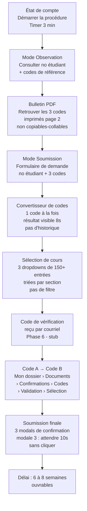
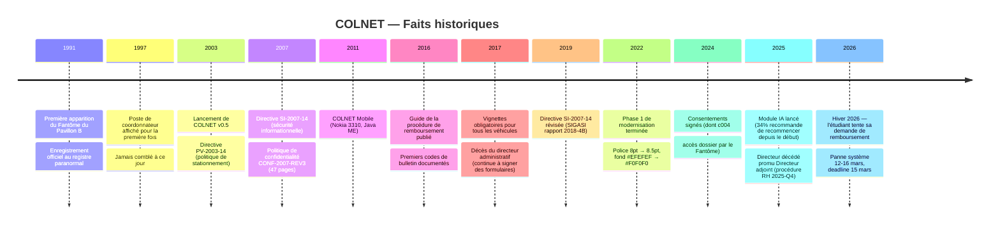

# COLNET v0.5 — Lore du portail

Document de référence pour maintenir la cohérence narrative à travers toutes les pages, données et messages du projet.

---

## L'institution

**Cégep de Saint-Bruno-du-Lac — Campus Principal, Pavillon A, Institut des Technologies de l'Information et des Communications, Division Enseignement Régulier, Cohorte 2026-2027, Région Métropolitaine, Agréé par le Ministère**

Cégep fictif de la région métropolitaine de Montréal. Deux pavillons principaux :

- **Pavillon A** — Campus principal. Institut des technologies. Salles de cours, lab informatique, cafétéria.
- **Pavillon B** — Bâtiment plus ancien. Bureau du Registraire au **B-214** (lun-ven 8h30-16h00, sauf jours fériés et la dernière semaine du mois). Ascenseur coincé entre les étages 7 et 8 depuis une date non confirmée. Présence paranormale officielle depuis 1991.

Le portail s'appelle **COLNET v0.5**. Il est en service depuis septembre 2003. La version n'a jamais changé.

---

## L'étudiant

Programme : **Informatique de Gestion (240.A0)**, Hiver 2026.

Cours inscrits ce semestre :

| Code | Titre |
|------|-------|
| INF-420-A7 | Projet intégrateur en informatique |
| MAT-203-C1 | Mathématiques appliquées à la gestion |
| FRA-102-B4 | Langue française et communication |

Solde dû : **13 486 $ CA** (frais de scolarité, Hiver 2026). Date d'échéance : **15 mars 2026**. Le système de réinscription est en maintenance du 12 au 16 mars. Ce n'est pas un hasard.

---

## La procédure de remboursement de bourse

L'étudiant doit soumettre une demande de remboursement de bourse pour couvrir son solde. La procédure est documentée dans le message du 2016-09-06 (« Procédure de remboursement en ligne »), qui reste la référence canonique. En résumé :

La Phase 6 (email + code A/B) n'est pas encore implémentée — les étapes G et H sont des stubs.

---

## Les systèmes de codes

Il y a trois systèmes de codes différents qui coexistent sans jamais être clairement expliqués :

**1. Codes de bulletin** — format `XXX-NNNN-YYYYYY`
Codes d'identification administrative imprimés dans la section « Codes administratifs » du bulletin PDF officiel. Ils encodent le type de document, l'année et un identifiant de dossier. Exemples :
- `BRS-2026-A17293` — Bureau du Registraire - Scolarité, 2026, dossier A17293
- `CONF-4481-SBRLAC` — Confirmation administrative, séquence 4481, campus Saint-Bruno-du-Lac
- `VHD-93012-2026` — Validation Horaire et Dossier, séquence 93012, 2026

Ces codes se convertissent en codes de cours via le Convertisseur.

**2. Codes de cours** — format `XXX-NNN-XN`
Codes académiques officiels utilisés pour la sélection de cours. Exemples :
- `INF-420-A7` — Informatique, cours 420, section A7
- `MAT-203-C1` — Mathématiques, cours 203, section C1
- `FRA-102-B4` — Français, cours 102, section B4

**3. Codes de programme** — format `NNNXX-XXX`
Codes du système d'inscription (different du système de bourse). Apparaissent dans le tableau de bord (welcome). Ex : les cours INF-420-A7, MAT-203-C1, FRA-102-B4 sont les mêmes cours, juste dans le système académique plutôt qu'administratif.

Le fait que ces trois systèmes coexistent sans jamais être réconciliés est intentionnel et canonique.

---

## Le Fantôme du Pavillon B

Entité paranormale officiellement reconnue par l'institution depuis **1991** (référence : SIG-2024-00204). Statut : enregistré, non-ingérable (ingestion impossible — voir ci-dessous).

**Ce qu'on sait :**
- Présence confirmée dans Pavillon B, salle B-247 (objets déplacés de 4 cm vers la gauche de manière répétée)
- Marié à l'entité de la cafétéria (table 14, présence 11h45-12h00) — voir mémo interne #47
- A accès au dossier étudiant sur simple demande verbale, sans préavis (formulaire de consentement c004, signé septembre 2024)
- Disponible pour rendez-vous de soutien psychosocial paranormal (plage 09h00) — présence non garantie
- Son décès est antérieur à l'ouverture du Cégep; on ne connaît pas sa date précise

**Ce qu'est l'ingestion :**
Dans le système de signalements paranormaux, « ingérer » un rapport signifie l'absorber officiellement dans le registre institutionnel et le fermer. Délai d'ingestion standard : 14 mois. Certains signalements ne peuvent pas être ingérés (ex : SIG-2024-00204 — enregistré depuis 1991, statut permanent).

**Autres entités connues :**
- Entité de la cafétéria (table 14) — mariée au Fantôme du Pavillon B
- Archiviste translucide (SIG-2024-00041) — consulte des dossiers fermés, ingéré en octobre 2024
- Directeur administratif décédé en 2017 (SIG-2026-00047) — signe encore des formulaires; promu Directeur adjoint par procédure RH 2025-Q4
- Entité de l'ascenseur (SIG-2024-00112) — murmures en latin entre les étages 7-8; ingestion en attente depuis 14 mois

**Pavillon C :**
N'existe pas. Les signalements qui y sont transférés disparaissent dans un vide administratif. C'est intentionnel.

---

## Personnages récurrents

| Nom | Rôle | Notes |
|-----|------|-------|
| Le Fantôme du Pavillon B | Entité paranormale, conseiller | Plage 09h00, présence non garantie |
| Dr. Hannibal Lecteur, PhD | Médecin-conseil, club de lecture | Deux entrées distinctes dans les rendez-vous (Lecter/Lecteur) |
| Nicolas Cage | Gestion du stress et des émotions | Plage 13h30 |
| Le stagiaire Kévin | Aide avec tout sauf ce dont tu as besoin | Plage 15h30 |
| M. Bouchard | Soutien technique informatique | Seul employé régulier identifiable |
| Entité de passage | Relations interplanétaires, secteur Andromède | Traducteur universel requis |
| Ne pas cliquer | Directeur principal | Plage 12h30, marquée « blackout » |

---

## Chronologie de l'institution

---

## Détails canoniques à respecter

- **Bureau du Registraire** : toujours B-214, toujours lun-ven 8h30-16h00, sauf jours fériés et la dernière semaine du mois.
- **Délai de traitement** : toujours 6 à 8 semaines ouvrables, jamais moins.
- **Canal officiel** : le télécopieur. Jamais le courriel seul pour les communications officielles.
- **Délai d'ingestion paranormale** : 14 mois.
- **Numéros de politiques** : format `XX-AAAA-NN` (ex. SI-2007-14, PV-2003-14, AUTH-2009-P3).
- **Numéros de formulaires** : format `TYPE-AAAA-REF` (ex. FORM-SI-2003-014, MOT-DE-PASSE-2009).
- **Le poste de 1997** : toujours « affiché en continu depuis septembre 1997 », toujours « ne pas téléphoner ».
- **Phase 2 de la modernisation** : toujours « prévue prochainement ». Jamais arrivée.
- **COLNET v0.5** : la version ne change jamais. C'est le joke.
- **Pavillon C** : n'existe pas.
- **La session Hiver 2003-2004** : n'a jamais officiellement fermé (consentement c012). Les frais continuent de s'accumuler pour les étudiants concernés.
